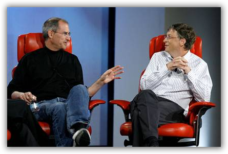

在大学阶段，其实说道计算机产业，基本上能想到只有 Gates 的名字，其他人都没有啥印象。虽然也再了解一些Linux的东西，不过还是感觉 Windows 撑起了整片天空。不过那个时候印象里的Gates只是一个商人的形象，其实他更是一个Geek，嗯，可能说Nerd更合适些。不过比起一般的Nerd，他的商业头脑还是强多了。

前几年乔布斯太热了，的确苹果的产品也做得太好了，加上苹果系统又是Linux的分支，慢慢就关注起来，从使用iPod开始到现在的Mac，温水煮青蛙逐渐跳到了苹果的坑里。乔布斯确实是很有意思的，不过因为各种商业的非商业的原因，现在基本都把它捧成了神，有些过头了。和 Gates 比起来，他算是个小清新吧，不过超级自恋就是了。

这两人其实是亦敌亦友的好友。他们极为相似，年纪相仿；聪敏好学；都大学辍学；从小就开始培养了很好的商业嗅觉；对未来科技的预见类似，比如现在的平板这样的东西；对科技的嗅觉都很强；都很会赚钱却不看重钱。而且他们都是超级偏执的，大家常常说乔布斯的扭转力场，很难相处。其实Gates也是一个德行，也是发脾气乱骂人，记得他在跟另一个微软创始人Allen初始接触时是这么说自己的，“我其实很好相处，不过你让我拿主意就行了。”

Jobs和Gates俩人的斗嘴很有意思。最经典那个大家都知道。最开始Gates是在给苹果系统开发软件的，苹果已经开始研发图形化操作系统了，Gates一边给Jobs打工，一边也悄悄的自己搞自己的Windows，1983年Windows 1.0 准备发布了，然后Jobs当然就怒了！把Gates叫到了苹果总部，当着十来个麦金塔团队成员的面，嚷到 “你在盗用我们的东西!” 接着，Gates平静地说出了后来成为经典的话，“我们都有个有钱的邻居，叫施乐，我闯进他们家准备偷电视机的时候，发现你已经把它盗走了。” 不过其实这两人吵了架却不是一拍而散的，而是一起呆了有两天，充分的进行了沟通。中间Gates还给Jobs演示了Windows，Jobs只说这是一坨屎，Gates回应，是砣好屎。

&nbsp;

 {{ site.baseurl }} 

一直没有把 Steve Jobs 和 Bill Gates 这段07年的D5访谈看完整过，在Youtube上看到了完整版就拖了下来，传到优酷了，有兴趣可以去看看，<a title="Steve Jobs and Bill Gates Together at D5" href="http://v.youku.com/v_show/id_XNjc3OTE1ODgw.html" target="_blank">优酷无字幕</a>。从上世纪六七十年代开始的这几十年时间里，计算机、互联网的飞速发展，成就了许许多多了不起的人，但就个人成就而言，即使你质疑他们的处事或人品，毫无疑问 Gates 和Jobs 达到了顶峰，后面还有没有人能超越不得而知了。他们俩人其实都算是退出了历史舞台了，Gates还会不会兴风作浪，不得而知，至少Jobs没有复出的可能了，回头再来看看当年他们同场出席的“绝唱”，很有意思 ^_^

07年这个访谈，用腐的观点来看，这两人真是太有爱了！^_^ 就像乔大人亲口说的，其实他们俩已经秘密结婚好多年了。

Gates对苹果还是有情节的，即便是作为竞争对手让苹果活下来的需要。1997 年苹果收购 NeXT 后，就是Jobs终于在苹果走下坡后，又作为公司顾问回到苹果工作，如果没有微软当时的1.5亿的投资，现在苹果究竟如何可能每人知道。当时Jobs和还是苹果 CEO 的吉尔·阿梅里奥去拜访盖茨，但是Gates当时难以判断他们两个谁做主。所以他私下给Jobs打电话，“这他妈是怎么回事，我是要把我的应用软件放在 NeXT 操作系统上吗?”  Gates回忆当时自己这样问道。Jobs说了些 “对吉尔的恭维话”，然后说局面很快就会清晰起来。(了解这个背景，就能看懂他们一开始谈话里那个梗了)

不过Jobs当然从来不觉得Gates帮了什么忙，微软产品是一坨屎的比喻，他几乎后面每年都说一遍。就像他一直接受访谈是说的，微软为什么会失败，因为它们的产品没有品味。这也是访谈里，Gates回答，如果有机会，他期望从Jobs哪儿学到的东西：Taste！完美的自嘲，不过我觉得也是相当真心的成份。

一个Nerd和一个小清新，思考的方式一开始就是截然不同的。如同俩人开创的商业模式也完全不同，如果没有Gates开创的软件产业，我们现在这群码农都没饭吃了。从Jobs的角度来看，微软当年那个犹如一坨屎的产品，居然占据了几乎100%的桌旁市场份额，直接把Apple逼入了绝境，也让他受益良多吧。

Jobs还算是穷人家孩子，或者他只想做他真心感兴趣的事，所以他一直奋斗在科技领域，何况后期他的病发，也没有留给他时间去做其他事情了。相比，Gates在08年就退出微软日常事务，专心投入做慈善真的很了不起。到现在，应该总共捐出了近20亿美元的善款，真的很了不起。就像他说的，科技不能改变一切。

Jobs最后引用Beatles的《Two of Us》来总结俩人的关系，“You and I have memories Longer than the road that stretches out ahead” 你和我共同拥有的回忆，比眼前绵延的道路更遥远。真是由不得让人悲叹一下~

&nbsp;

P.S.

吐槽一下，视频里的PC Guy的梗。虽然Gates已经有模有样了，不过看看他们的坐姿，你就明白Nerd永远都是Nerd，哈哈！

说来也快，Jobs都走了有2年多了，Apple虽然还在按部就班地往前走，但是毫无疑问，失去了不少特质。而前几天，Gates又宣布回到微软继续Part time的工作，这是08年退出微软日常事务，专心慈善6年后的回归。其实和之前Jobs回归拯救Apple有着异曲同工的味道，丢不下自己的“孩子”啊，至于结果如何，还要拭目以待了。

推荐一你再读读 ：<a title="Remember Steven Jobs" href="http://www.from0to1.net/remember-steven-jobs/" target="_blank">Remember Steven Jobs</a>

