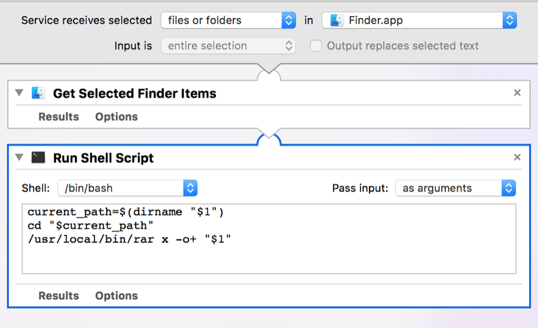
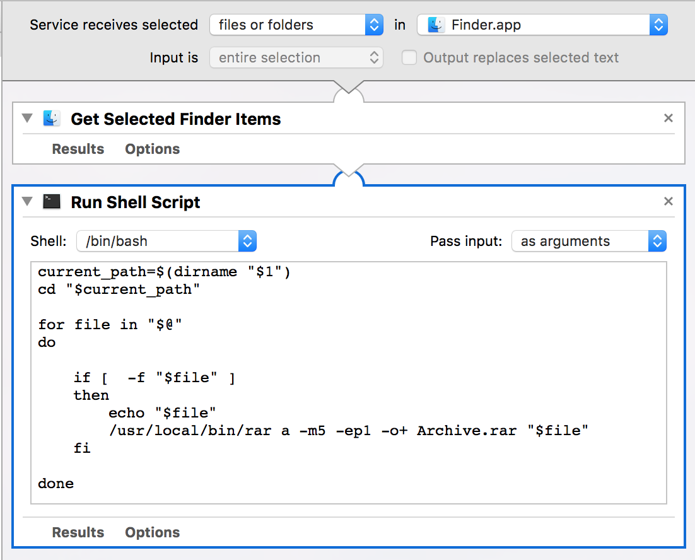

MacOS only integarted with ZIP, but RAR is quite frequently using standard. Not supprising you will use it.

## Install Homebrew

Ofcourse you can download RAR by yourself, but strongly suggest using Homebrew for these kind tools. Go [Homebrew site](https://brew.sh) to install Homebrew first.

Then you can install rar with:

```bash
$ brew install rar
```

## Using RAR

As RAR installed, you can alwasy easy to extract rar file in Shell as:

```bash
$ rar x some-rar-file.rar
```

By the way, you can open shell and go to the file directory easily with [Go2Shell](http://zipzapmac.com/Go2Shell) , Go2Shell can also be install with Homebrew liek :

```bash
$ brew install go2shell
```

## Integrate with Automater

But as doing that ( open Shell and input script ) for long time, finally tired. Thus spend some time to add **rar** and **unrar** in to Services like this:


To do this you need open application **Automator** and create 2 documents as **Services** type :




